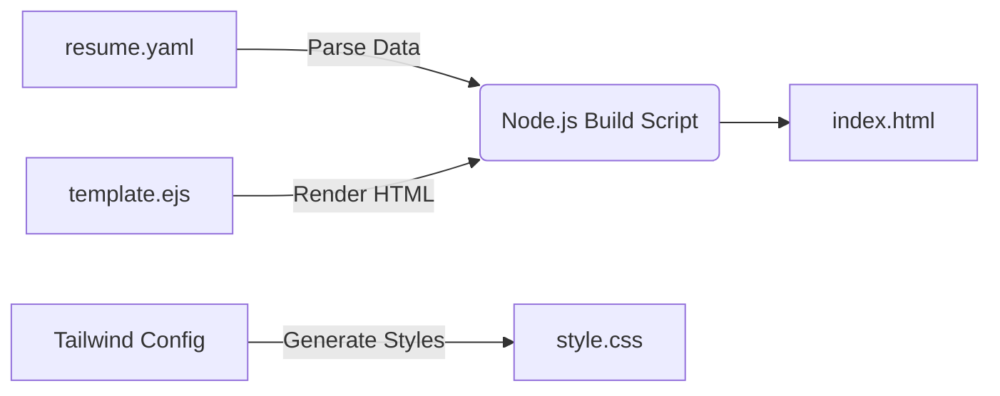

# Custom Portfolio Static Site Generator (SSG)

A high-performance, custom-built Static Site Generator used to build my personal portfolio.

Unlike standard templates, this project is engineered from scratch using **Node.js** to decouple content (YAML) from presentation (EJS/Tailwind). It features a fully responsive design, a custom dark mode engine, and an automated build pipeline.

**🔗 Live Demo:** [https://prajjwalmehta.github.io/portfolio/](https://prajjwalmehta.github.io/portfolio/)

## 🚀 Key Features

- **Custom Build Engine:** A Node.js script (`build.js`) that reads structured data and compiles it into static HTML.
- **Data-Driven:** All content is stored in a clean `resume.yaml` file, making updates instant without touching code.
- **Component-Based UI:** Built with **EJS** templates for modular, reusable code structure.
- **Modern Styling:** Styled with **Tailwind CSS** (v3) using utility classes, arbitrary values, and a custom configuration.
- **Interactive Dark Mode:** A vanilla JavaScript engine that persists user preference via local storage and toggles Tailwind's `dark:` classes.

## 🛠 Tech Stack

- **Runtime:** Node.js
- **Templating:** EJS (Embedded JavaScript)
- **Styling:** Tailwind CSS (JIT Engine)
- **Data:** YAML
- **Deployment:** GitHub Pages

## ⚙️ Architecture

The build process follows a strict "Separation of Concerns" pipeline:

